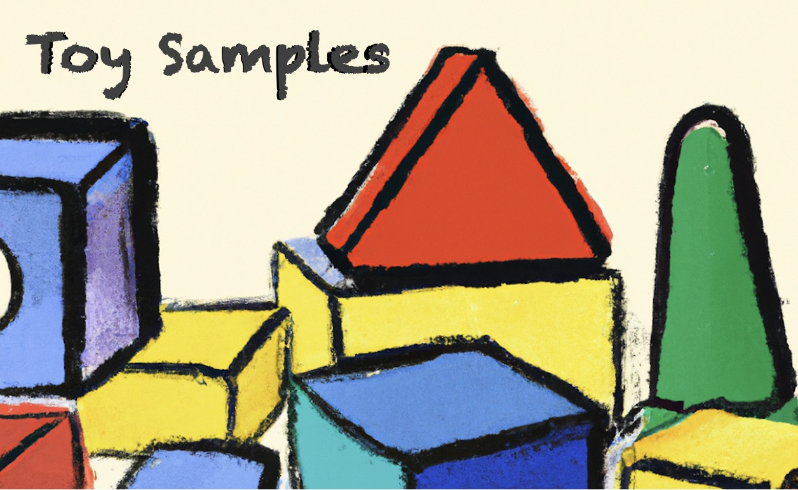

# Toy Samples

Let us experience a rapid setup process for play ground `toy-samples` with minimal user interaction using `vamos` (a `playground manager`). 


## Step 1

This step is only required if `vamos` is not yet installed and can otherwise be omitted.
In a `BASH` shell with `git` and `python3` installed run the following `curl` command: 

```
   $ curl https://raw.githubusercontent.com/jmpstart/vamos/main/install >~vamos; source ~vamos -s
```

## Step 2

With ´vamos´ installed, choose a working directory for creation of a git repository folder `toy-samples` by invoking:

```
    $ vamos @jpmstart/toy-samples
    ...
    succesful installation of playground `toy-samples`
    type ? for quick help
    (venv) $
```

If the installation was successful you will get a message about the successful installation of playground and a hint, that a command ? has been provided for quick help regarding the playground.

Also note the character sequence `(venv)` as part of the command line prompt, which indicates, that the virtual environment of the playground is activated. If for any reason (e.g., open a new console/terminal window) `cd` to the playground's home folder (`toy-samples`) and invoke `$ . vamos` to re-activate the playground.


## Exploring the Playground

Get quick help by hitting the `?` command:

```
    (venv) $ ?
    playground toy-samples: try the following commands:
        roulette      # a python program using NumPy package
        scan          # a python BLE scanner using Bleak package
        lol           # a BASH script outputing colored text
    (venv) $
```

The toy samples by themselves are not very impressive. The focus here is more on the `rapid installation process` of a playground from a github repository with
autonomous setup of an environment (see appendix). Such environment provides BASH executable programs/utilities based on Python or Bash scripts (but not only restricted to), which are related to a virtual environment, i.e., are only inactive in the context of an activated virtual Python environment.

## Roulette

```
    (venv) $ roulette
    17
    (venv) $ roulette
    3
    (venv) $ roulette
    35
    ...
```

## Scan

`scan` is a tiny Python program which prints a list of advertising Bluetooth Low Energy devices in the vicinity. It requires a BASH shell having access to the `Bluez` Bluetooth stack in connection with Bluetooth hardware. 


## LoL

'lol` is a BASH script demonstrating the use of colors

```
    (venv) $ lol
    Laugh out loud: hahaha, haha, hahahaha
```

 
## Appendix: Vamos Installation Process

Invoking command

```
    $ vamos @jpmstart/toy-samples
```

runs a two-phase `vamos` installation process. In phase 1 the following three steps are performed:

* clone repository ´https://github.com/jmpstart/toy-samples.git into a new created folder `./toy-samples`
* subsequently the working directory is changed to this folder
* and startup script ./.vamos/bin/startup is `sourced` (executed in current BASH environment)

In phase 2 the specific startup script of 
playground `toy-samples` is executed:

* create a `venv` folder representing a virtual Python environment
* activate the vitual Python environment
* upgrade Python `pip` package
* install another Python package
* copy of some BASH scripts (our `toy samples`) from .vamos/bin into venv/bin
* provide a quick help command to be invoked by `$ ?`


